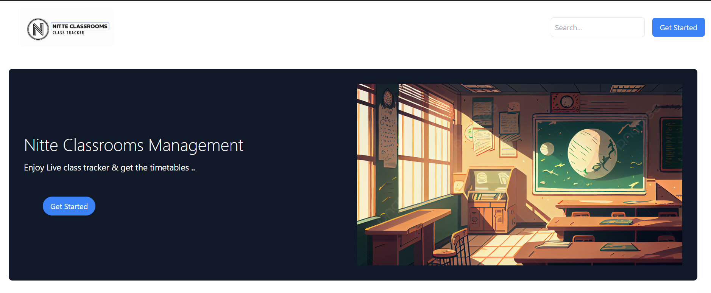
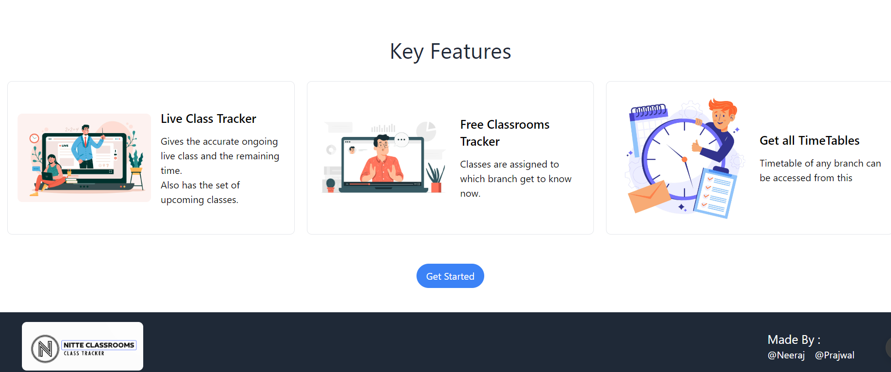
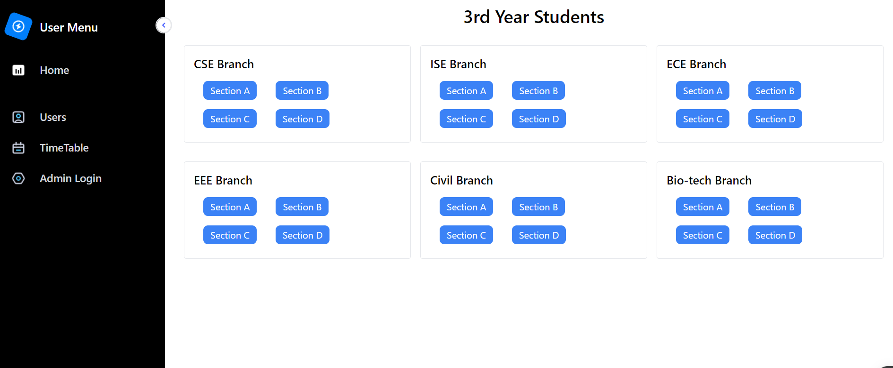
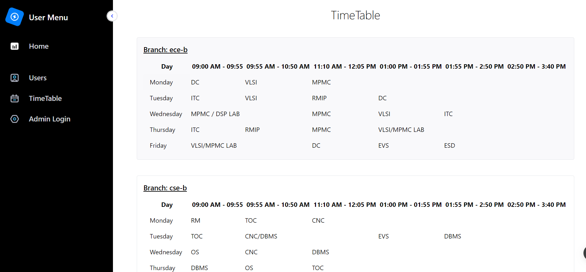
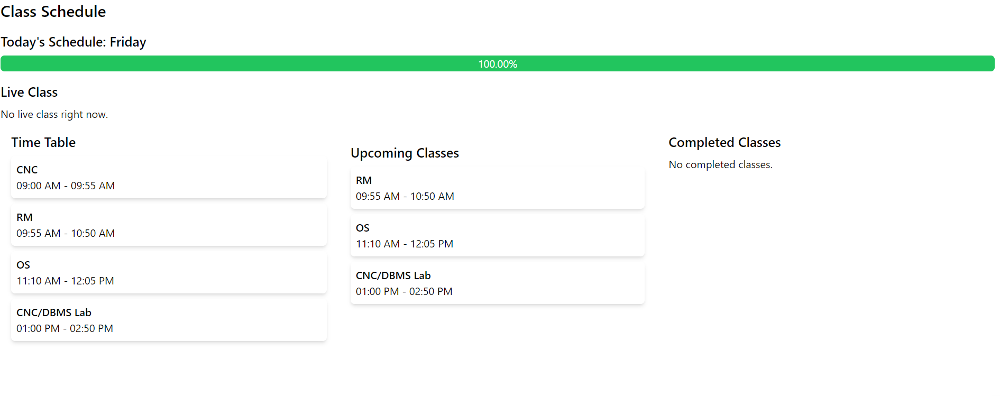

# Classroom-Management

#This project primarily focuses on current ongoing classes and thereby knowing which classes are occupied and which are not. 

#Also if occupied we can know which class is going on and when does it end. 

#Basically the timetable has been uploaded from which we can know the timings of classes and its ending time.

*Some of the website screenshots are shown below:

1. Landing Page

2. All Branch Timetable

4.Live Class tracker 

** Still project needs many changes and updates to be made..
